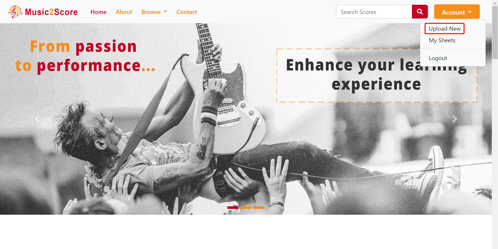

  

# Welcome to the bypass of Music2Score

- ## Our website&ensp;-------------->&ensp;[Music2Score.xyz](https://music2score.xyz)

- ## Our git repository&ensp;------->&ensp;[Music2Score](https://github.com/music2score/music2score)

- ## Try with MIDI files?&ensp;------>&ensp;[MIDI Samples](https://git.uwaterloo.ca/z7sheng/sprout/-/tree/master/music2score/samples)

  &emsp;
  &emsp;
<!-- I am going to add a quick demo tonight... -->

## Walking through Music2Score

&emsp;Visit our website through [Music2Score.xyz](https://music2score.xyz) :point_left:&ensp;It is saying hello to you! :smile:
&emsp;**Sign up** your account in the **top right corner**. Of course, you may **sign in** with our guest account instead `welcome@music2score.xyz`. I am not telling you the password is "OneTwoThree" in digits though. :confused:

&emsp;
&emsp;After login, you are permitted to upload your own music files.
&emsp;Click on **Upload New** in the **top right corner** (or **Upload Your Own File** in the **bottom left corner**) to explore that functionality. 

&emsp;

&emsp;

&emsp;

&emsp;

&emsp;

&emsp;

## abc

