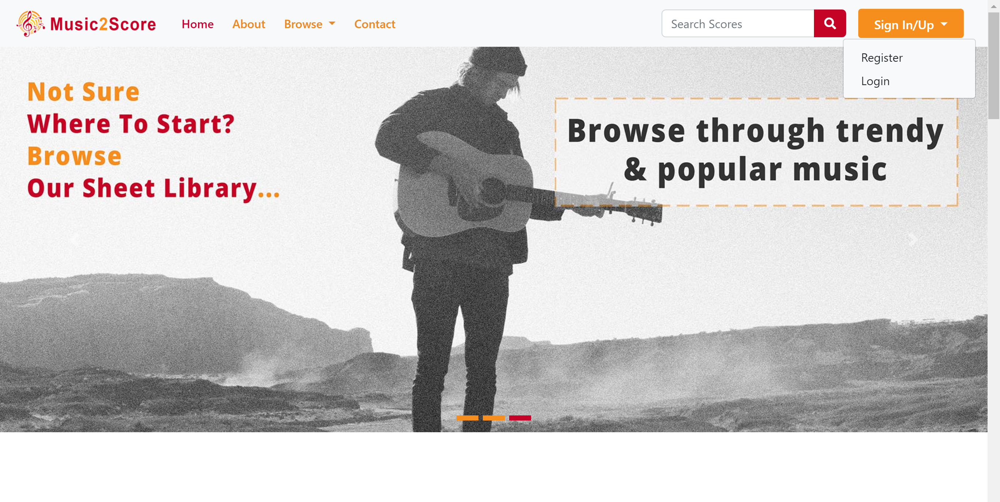
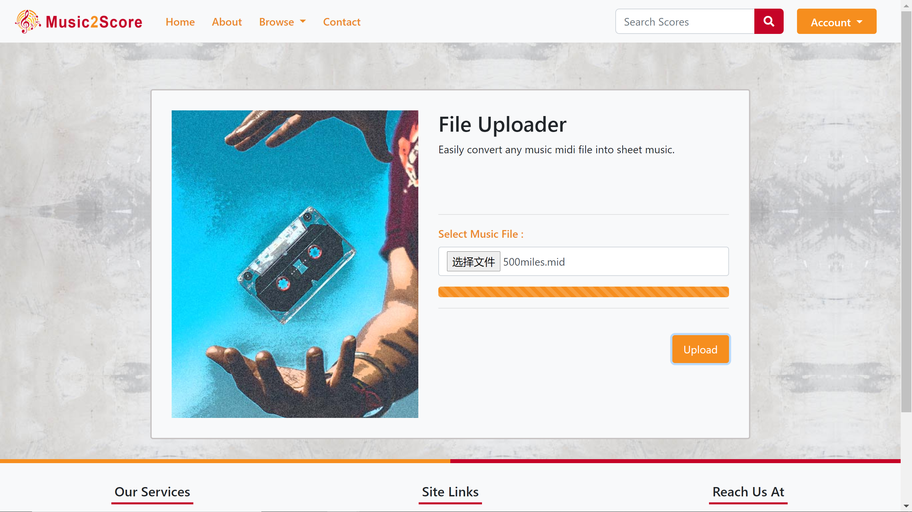

  

# Welcome to the bypass of Music2Score

- ## Our website (VPN needed)&ensp;------>&ensp;[Music2Score.xyz](https://music2score.xyz)

- ## Our git repository&ensp;---------------->&ensp;[Music2Score](https://github.com/music2score/music2score)

- ## Try with MIDI files?&ensp;--------------->&ensp;[MIDI Samples](https://git.uwaterloo.ca/z7sheng/sprout/-/tree/master/music2score/samples)

  &emsp;
  &emsp;
<!-- I am going to add a quick demo tonight... -->

## Walking through Music2Score

&emsp;Visit our website through [Music2Score.xyz](https://music2score.xyz) :point_left:&ensp;It is saying hello to you! :smile:  
&emsp;**Sign up** your account in the **top right corner**.  
&emsp;Of course, you may **sign in** with our guest account instead: `welcome@music2score.xyz`  
&emsp;I am not telling you the password is "OneTwoThree" in digits though. :confused:

&emsp;  
&emsp;After login, you are permitted to upload your own music files.  
&emsp;Click on **Upload New** in the **top right corner** (or **Upload Your Own File** in the **bottom left corner**) to explore that  
&emsp;functionality. 

&emsp;For the current release, **MIDI** is the only format that we support.  
&emsp;We are still working on other cool features including accepting waveform files.  
&emsp;No MIDI file on your device? No worries, please try with our license free samples [here](https://git.uwaterloo.ca/z7sheng/sprout/-/tree/master/music2score/samples).

&emsp;  
&emsp;New requests queue up for processing.  
&emsp;Fortunately, it will not be too long to wait because typically, there are at least 3 kernels running concurrently.  
&emsp;Music2Score also reserve and show the latest 10 conversions of history for each account. 

&emsp;

&emsp;You can **view** the sheet-score online or **download** it as a pdf.  
&emsp;Hum the opening bars~~<!--  :musical_score::notes::notes::musical_note::notes: -->  
&emsp;Ain't this the melody that you familiar with? <!-- :musical_keyboard::musical_keyboard: -->

&emsp;

&emsp;In addition, you can explore the existing library and search socres by instrument, such as violin.  
&emsp;You can play with the search bar as well.  
&emsp;Maybe search by composer such as Mozart, Beethoven, Bach, Schubert...

&emsp;

&emsp;

<!-- This way needs visitors to login -->
<!-- ../../data_repo/music2score/ -->